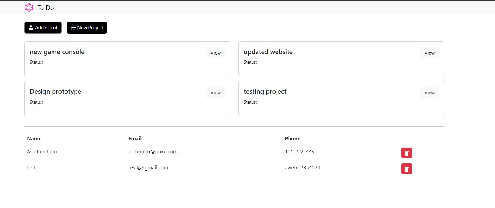

# Project-Management-

## Github Repo:
https://github.com/Abhi20220/Project-Management-

## Goals
The purpose of this application is to create a management system where projects can be created, updated and deleted, and with each project they are associated with a client. 

## Problems
1. When a project is clicked on the page is not rendered.
2. The application crashes on heroku

## Web App Overview
